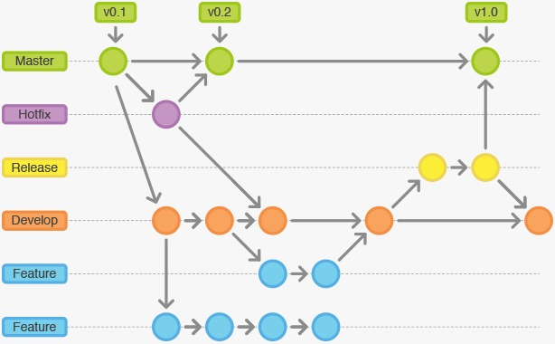

# Git and Github

## master

- Código estable que se usa para desplegar en producción.

## develop

- Esta rama es donde estén reflejados los últimos cambios realizados, y que sirve como rama de integración con master.

## feature

- La rama feature se desarrollan nuevas características del proyecto, partiendo siempre de la rama develop. Incorporando los cambios a la misma, eliminando posteriormente la rama.

## hotfix

- hotfix se utilizan para corregir errores detectados en el código en producción, por lo que en este caso se parte de la rama master evitando de esta manera incluir cambios realizados en la rama develop que pueden no estar todavía estables.

## realese

- Esta se usa cuando se va a realizar un despliegue de una versión del código en el servidor de producción se abre una rama de este tipo.

## bugfix

- bugfix se utilizan para corregir errores, o bugs detectados en el código, por lo que en este caso se parte de la rama develop realizando cambios en la rama develop.

